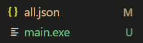
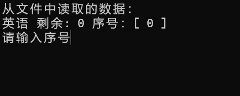

# 作业自动预计器
你是否有如下的烦恼？
- 作业还有多少面写完
- 想知道还要多久才能写完以分配时间
**I can do this~~~**
___
## 使用方法
1. 下载版本文件中的zip文件**千万不要下载Source code**
2. 解压，你会看到如下的文件

3. 点击all.json 你会看到如下的内容
```json
[
    {
        "content": "英语",
        "page": 0
    }
]
```
4. 添加你想要统计的学科，格式如下
```json
,
    {
        "content":"学科名",
        "page" : 0
    }
```
**请将上面代码块内容全部复制，在中括号的上一行粘贴，看起来应该是这样的(学科名字和page对应的值可替换)**
```json
[
    {
        "content": "英语",
        "page": 0
    },
    {
        "content":"学科名",
        "page" : 0
    }
]
```
5. 编辑完后保存，打开**main.exe**你会看到如下的画面

6. 用键盘输入序号并回车，会出现以下的画面

7. 完成一面作业时，请按下任意键

#### 配置完成，恭喜！🎉🎉🎉
# issues
- 不知道XD